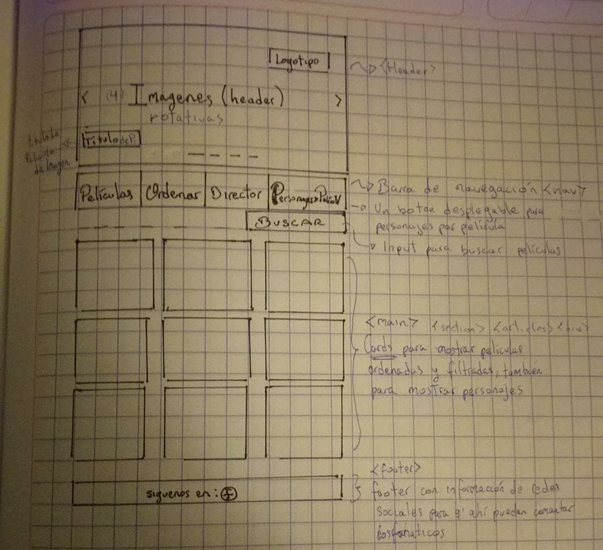
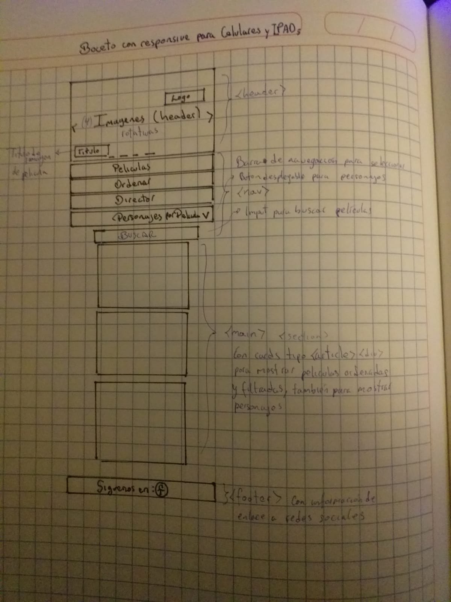
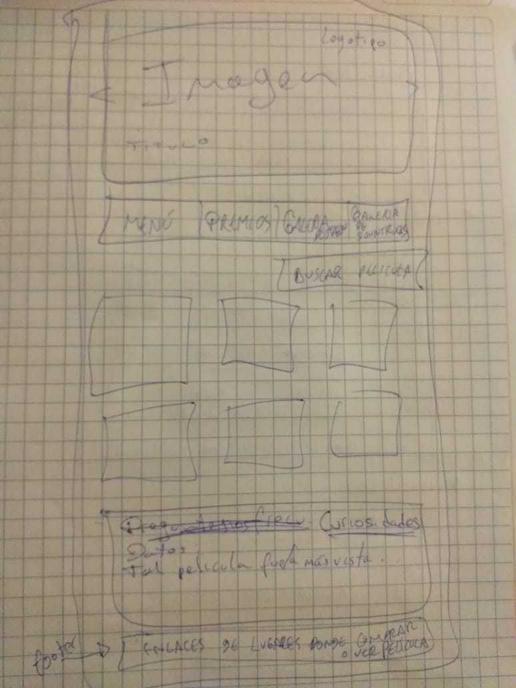
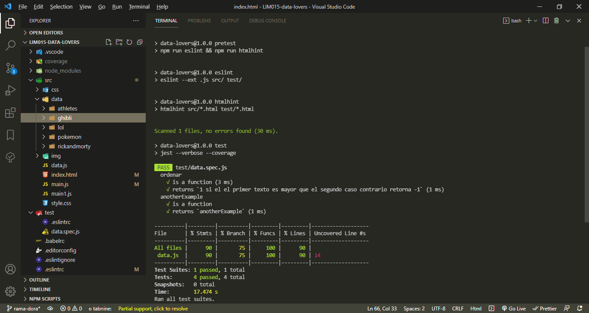

# Studios Ghibli con Data Lovers #

Studios Ghibli posee uno de los fandoms mas grandes del mundo, asi mismo sus historias son para todos los grupos etáreos, es por ello que los elegimos como tema de nuestro proyecto.

1. Definición del Producto

Es una interfaz web pensada en responder a los requerimientos de los usuarios, enfocandonos en la relacion entre el mundo de Studios Ghibli y tres tipos de usuarios (amateur, regulares y expertos). Asi mismo la página esta orientada a los requerimientos de estos tres tipos de usuarios distintos, para la definición de estos usamos las historias de usuarios y para la elaboración de la página partimos de la realización del boceto orientado al cumplimiento de los objetivos de aprendizaje.

* Historias de Usuario
Link de historias de usuario: https://docs.google.com/document/d/1L0cbhxTdZEeIBjJgAAJ1BuYgQwey1i_bFVVC3RLWcvg/edit

A partir de la aplicacion de un cuestionario orientado a usuarios que conocen Studios Ghibli y la sistematización de este, logramos la definición de historias de usuario. Decidimos solucionar los problemas de los usuarios, añadiendo los requerimientos de información que desean visualizar en una pagina web de Studios Ghibli. Los usuarios amateur requieren de información en Cards o box de las películas. Los usuarios regulares requieren de un Botón que les lleve a la información de personajes y sus características. Para los usuarios expertos se creo un Modal con información de sinopsis de las películas y un enlace en el footer para redes sociales. En función a las historias de usuario diseñamos los bocetos, pensando tanto en usuarios que se conectan a traves de un monitor, como de una tablet y de un celular, se realizo bocetos para la interfaz web vista desde una monitor y para la página vista desde una tablet o un celular. Las fotos de estos bocetos dibujados estan en la carpeta img como bocetos.

2. Plan de Acción: 

El plan de acción se realizó apartir del enfoque de cumplimiento de objetivos de aprendizaje para esto usamos el aplicativo trello donde ordenamos y organizamos el paso a paso, desde la investigación a través del diseño y aplicación del cuestionario para conocer a los tipos de usuario, posteriormente armar las historias de usuario, luego realizar los bocetos en base a estas historias de usuario. Así mismo usamos Trello como Zeplin, donde como dupla data lovers, compartimos un espacio de trabajo estructurado para publicar diseños, en trello también pudimos colaborar enviando productos del diseño y además fuimos registrando nuestros objetivos, compartiendo información de enlaces didacticos que aporten en la apropiación de nuestro aprendizaje. 
Link de trello: https://trello.com/b/UJAcTgil/priorizaci%C3%B3n-de-objetivos

2. Objetivos de aprendizaje:

# Diseñar la aplicación pensando y entendiendo al usuario: 

Priorizamos el diseño a partir de la difinicion de requerimientos segun las 3 historias de usuarios que seleccionamos  aplicando los principios de diseño visual (contraste, alineación, jerarquía).

# Crear prototipos para obtener feedback e iterar: 

Luego creamos los bocetos y apartir de estos fuimos avanzando con la funcionalidad de la aplicación web, construyendo la aplicación a partir de la maquetación y el boceto. Presentamos los avances en demos y recibimos los feedbacks de los coaches y las compañeras.

# Uso de HTML semántico:

Luego de realizar el boceto y maquetación procedimos a repasar los conceptos mas importantes del Html semantico, su estructura y las propiedades de las etiquetas.

# Uso de selectores de CSS, flexbox y grid:

Procedimos a estudiar el uso de los selectores del CSS y para ordenar, marcar y estilizar la disposicion de acuerdo a la maquetación estudiamos y aplicamos el flexbox, a través del display flexbos en CSS, para complementar tambien usamos el sistema de grid y grillas en CSS lo cual nos ayudo a definir la maquetación de la mano de la adecuada distribución de etiquetas del Html de acuerdo a nuestro boceto.

# Uso de selectores, manejo de eventos y manipulación dinámica del DOM:
Localizamos los elementos del DOM usando los selectores, por ejemplo .getElementById() . Asi mismo usamos los eventos del DOM por ejemplo .addEventListener() aplicamos dinamismo al Dom usando innerHTML.

# Objetivos de JavaScript:
   * Uso de bucles for: 
   En las funciones aplicadas tambien usamos los bucles for para recorrer la data y filtrar lo requerido.

   * Uso de funciones (parámetros | argumentos | valor de retorno)]
   Las funciones nos fueron de gran utilidad para filtrar la data, utilizando los parametros como valores, variables u objetos, asi mismo indicando los argumentos o instrucciones adecuados para lo requerido.

   * Manipular arrays (filter | map | sort]
   Usamos diferente metodos avanzados como sort para ordenar la data filtrada y devolverla ordenada, tambien usamos el método filter que crea una matriz llena de todos los elementos de la matriz que pasan una prueba (proporcionada por una función). Filter no ejecuta la función para elementos de matriz vacíos.Filter no cambia la matriz original. Tambien usamos el método map que crea una nueva matriz con el resultado de llamar a una función para cada elemento de la matriz. El método map llama a la función proporcionada una vez para cada elemento de una matriz, en orden. Map no ejecuta la función para elementos vacíos y no cambia la matriz original.

   * Manipular objects (key | value)]
   Usamos los siguientes metodos para objetos simmples, Object.keys (obj): devuelve una matriz de claves.
  Object.values ​​(obj): devuelve una matriz de valores. Object.entries (obj): devuelve una matriz de pares [clave, valor]

# Uso ES modules: 
   Import y export. Entendimos el uso de los modules por ejemplo a partir del module de data ghibli exportado hacia el main.js donde podemos importar la información para su manipulación con el DOm y las funciones. 

# Diferencia entre expresión y sentencia
   Una declaración o sentencia es una instrucción que define una acción. En JavaScript existen dos formas de crear una función: declarando la función, o mediante una expresión.Ambas funciones pueden ser invocadas llamándose por el nombre de la función, en el caso de la función-sentencia, o de la variable en el caso de la función-expresión. No obstante la declaración en sí misma no retorna ningún valor.
   
   Una expresión es cualquier unidad de código que se resuelve en un valor. Los dos ejemplos más comunes de expresiones que nos vamos a encontrar son los siguientes:
   Expresiones aritméticas: Una expresión que evalúa un número. Expresiones lógicas o booleanas: Una expresión que evalúa si algo es verdadero o falso.

# Diferenciar entre tipos de datos atómicos y estructurados.
   Diferenciamos entre datos primitivos, datos compuestos y estructuras de ordenamiento del código.

# Testeo unitario

  Ejecutamos los tests. Obteniendo los siguientes resultados respecto a los archivos All files y Data js
  Branch %75
  Funcs  %100
  stmts  %90
  Lines  %90
  Adjuntamos el detalle en la carpeta img  y en la sub carpeta imagen de test.   
  
   
 

# Estructura del código y guía de estilo

  Organizamos y dividimos el código en módulos (Modularización)
  Aplicamos modularización para el codigo del ÇSS, HTML, DOM y JS
  Uso de identificadores descriptivos Nomenclatura y Semántica, usamos camelcase para nombrar variables y metodos. Nombramos ficheros, declaramos propiedades, todo ello para mantener la claridad y coherencia del codigo y facilitar su lectura del mismo.

# GitHub
  Estudiamos y practicamos el uso de comandos de git (add | commit | pull | status | push)]

  Manejamos repositorios de GitHub (clone | fork | gh-pages)

  Colaboramos como equipo o dupla a través de Github branches, pull requests.

